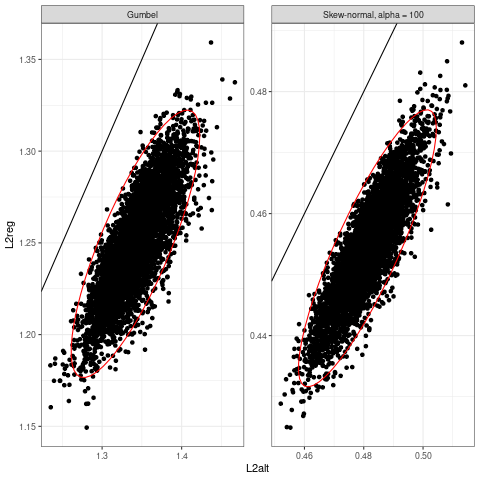
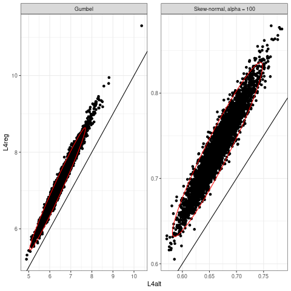

# L4-optimality

Linear regression provides predictions that are optimal with respect to the L2 criterion. L2 is the loss function defined as the mean of squared (the "2" in "L2") prediction error. What about L4-optimal predictions? If the error distribution is asymmetric, the intercept can be corrected, based on error skewness.

# Background

Assume Y is the target of prediction. Input X can be used to base prediction. A linear model provides predictions that are square-error-optimal, in the sense that they minimize the mean of squared errors.

One may consider a different loss function, like the mean of errors raised to the 4th power. This would be highly inconvenient with real data with typical outliers (what an oxymoron). Anomalous data can deeply affect the estimation process. But this is an example of why inference is distinct with respect to prediction.

Inference has to do with the search for the true data generating process, which is one thing for the classical statistician, and there may exist different methods to estimate the *same thing*. Prediction instead can be different, based on the optimality criterion. The mean is optimal prediction with respect to L2, while median is optimal with respect to L1.

If L4-optimality is the focus, optimal prediction is m + s*(C - 1/C), where:

*  m is linear regression's prediction,
*  s is error's standard deviation,
*  C = cube root of (r + sqrt(r^2 + 4))/2,
*  r is the error's skewness.

This can be seen with derivatives and basic calculus.

# Simulations

I simulate some 10k datasets, with p predictors and n observations. Half observations are used to estimate regression coefficients, the other half is used later, to estimate s and r. I do so to avoid issues in the estimation of s and r that are caused by the estimation of regression coefficients. So I can provide both regression predictions and L4-optimal predictions after a slight modification of the former ones.

After estimating optimal coefficients, I use them to predict future data. I save both L2 and L4 losses for both L2-optimal and L4-optimal predictions.

I simulated skew-normal and Gumble-distributed response Y, as two examples of skewed data.

Here are the L2 losses (the lower the better) for both types of predictions.

See, regression outperforms L4-optimal any other prediction, as expected. The line separates situations where the best is either regression (above) or L4-optimal prediction (below).

Here are the L4 losses (the lower the better) for both methods.

See, L4-optimal prediction makes the day with respect to classical regression. Again, regression can be better (above) otherwise L4-optimal will be (below).

# Remarks

Little probability calculus, along with derivatives and Cardano's formula for cubic equations are required.

This is a toy example. True regression coefficients and error's variance were set equal to a custom value, but without loss of generality because this is a composite group family (can skip this).

It is a cute example of relativity implied in optimality ideas, in the sense that objectives can differ, while math will straightforwardly tell the only optimal choices under that criterion.

So under the L4 criterion a close form solution for optimal prediction exists, which just adjusts (:D) the intercept estimated by least squares. With L6, L8, etc analogous ajustments exist that involve fifth-order moments, seventh, etc. One can use an out-of-bag sample to estimate the optimal intercept without the need of an exact and general formula.

It is interesting to note how under Linfinity loss function, the optimal prediction is mid-range regression.
